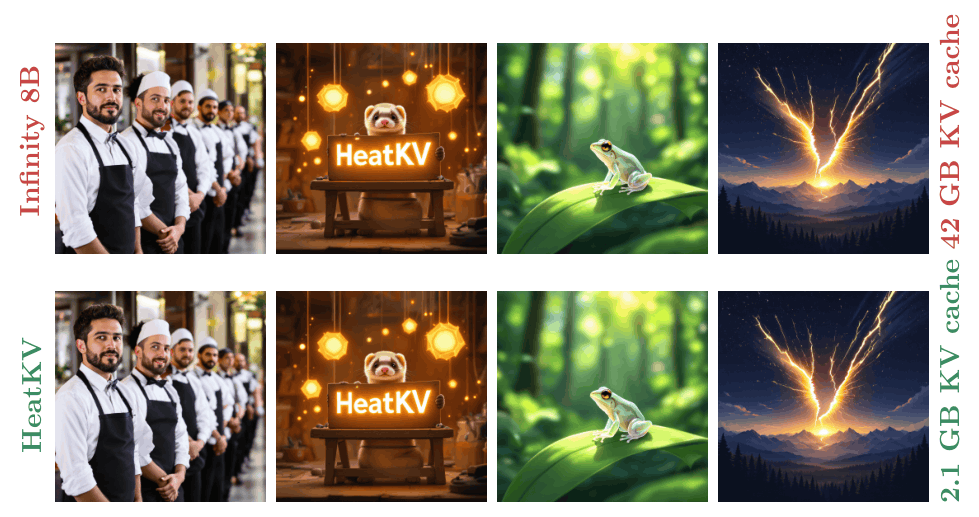
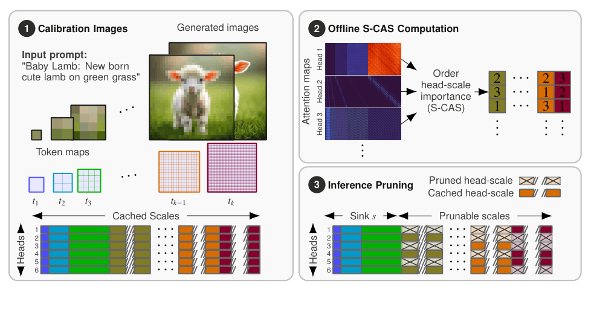

<!-- SPDX-FileCopyrightText: Copyright 2026 Arm Limited and/or its affiliates <open-source-office@arm.com> -->
<!-- SPDX-License-Identifier: MIT -->

# :fire: HeatKV: Head-tuned KV-cache Compression for Visual Autoregressive Modeling
<p align="center">
  <a href="https://arxiv.org/abs/2605.14877">
    
  </a>
  <a href="LICENSE">
    
  </a>
</p>
<div align="center">

### [Jonathan Cederlund](https://jocen01.github.io/)<sup>1,2</sup>, [Axel Berg](https://scholar.google.com/citations?user=8ajzhYYAAAAJ)<sup>1</sup>, [William Isaksson](https://wi001.github.io/)<sup>1</sup>, [Durmus Alp Emre Acar](https://scholar.google.com/citations?user=Yo_NxlcAAAAJ)<sup>1</sup>, [Chuteng Zhou](https://scholar.google.com/citations?hl=en&user=IQbOdyYAAAAJ)<sup>1</sup>, [Pontus Giselsson](https://portal.research.lu.se/sv/persons/pontus-giselsson/)<sup>2</sup>

<sup>1</sup> Arm &nbsp;&nbsp;
<sup>2</sup> Dept. of Automatic Control, Lund University

</div>

<br>

<p align="center">
  
</p>


## Overview

HeatKV is a memory-efficient KV-cache compression method for Visual Autoregressive (VAR) models that enables high-quality image generation under strict memory budgets.

HeatKV leverages stable attention patterns observed across attention heads and image scales to construct a static, head-specific cache allocation policy. Using a small offline calibration set, attention heads are ranked according to their dependency on previously generated scales through the proposed **Scale-dependent Cumulative Attention Score (S-CAS)**. Given a target memory budget, HeatKV selectively prunes low-importance head-scale pairs while retaining the most relevant cached information.

By allocating cache capacity at the head-scale granularity, HeatKV maintains strong fidelity to the original model even under aggressive compression, achieving substantial reductions in KV-cache memory usage while preserving image quality, prompt alignment, and perceptual quality.


<p align="center">
  
</p>
For technical details, see our paper:

> **HeatKV: Head-tuned KV-cache Compression for Visual Autoregressive Modeling**  
> [https://arxiv.org/abs/2605.14877](https://arxiv.org/abs/2605.14877)


This folder contains scripts for running Infinity with and without HeatKV, profiling inference speed, and generating S-CAS scores/orderings.

## Third-Party Code

The `infinity/` directory and `tools/run_infinity.py` are derived from the
MIT-licensed FoundationVision Infinity project. See `THIRD_PARTY.md` for the
preserved upstream notice.

## Environment

Create the conda environment from the explicit lock file:

```bash
conda create -n heatkv python=3.12 pip -y
conda activate heatkv
pip install torch==2.11.0+cu128 torchvision==0.26.0+cu128 \
  --extra-index-url https://download.pytorch.org/whl/cu128
pip install -r requirements.txt
pip install flash-attn==2.8.3 --no-build-isolation
```

Run commands from the repository root:

```bash
cd /path/to/HeatKV
```

## Download Weights

The scripts expect model weights under `./weights`. Make the directory first:

```bash
mkdir -p weights
```

Download the shared text encoder:

```bash
hf download google/flan-t5-xl --local-dir ./weights/flan-t5-xl
```

For the 2B model:

```bash
hf download FoundationVision/Infinity --include "infinity_2b_reg.pth" --local-dir ./weights/
hf download FoundationVision/Infinity --include "infinity_vae_d32reg.pth" --local-dir ./weights/
```

For the 8B model:

```bash
hf download FoundationVision/Infinity --include "infinity_8b_weights/**" --local-dir ./weights/infinity_8b_weights
hf download FoundationVision/Infinity --include "infinity_vae_d56_f8_14_patchify.pth" --local-dir ./weights/
```

If Hugging Face requires authentication, run:

```bash
hf auth login
```

## Generate HeatKV Comparisons

Generate a 2B baseline image, a 2B HeatKV image, and a side-by-side comparison:

```bash
python generate_2b_heatkv_comparison.py \
  --prompt "A photo of a red sports car on a mountain road" \
  --output-dir outputs/heatkv_2b_comparison
```

Generate the same comparison for the 8B model:

```bash
python generate_8b_heatkv_comparison.py \
  --prompt "A photo of a red sports car on a mountain road" \
  --output-dir outputs/heatkv_8b_comparison
```

Each script writes `*_without_heatkv.png`, `*_with_heatkv.png`, and `*_comparison.png` to the output directory.

## Generate COCO Metrics

Generate paired baseline/HeatKV images on COCO2017 and compute PSNR, LPIPS, and FID:

Heads up: this generates 5000 baseline images and 5000 HeatKV images. A full run can take 3 or more hours, depending on the GPU and model size.

```bash
python generate_heatkv_coco5000_metrics.py \
  --dataset coco2017 \
  --count 5000 \
  --model 2b \
  --output-root outputs/coco2017_heatkv_5000
```

For the 8B model, use:

```bash
python generate_heatkv_coco5000_metrics.py \
  --dataset coco2017 \
  --count 5000 \
  --model 8b \
  --output-root outputs/coco2017_heatkv_5000_8b
```

Use `--skip-metrics` to only generate image folders, or `--skip-generation` to compute metrics from existing generated folders.

## Profile Inference Speed

Use `profile_cache_methods.py` to time baseline and cache/pruning methods. The profiler currently uses the 2B model settings.

```bash
python profile_cache_methods.py \
  --methods baseline real_scale_fused_segmented \
  --batch-sizes 1 \
  --prompt "A photo of a red sports car on a mountain road" \
  --seed 0 \
  --warmup 1 \
  --repeats 5 \
  --head-specific-budget 0.1 \
  --head-specific-initial-scales 3 \
  --json-out outputs/profile_2b.json
```

## Generate S-CAS Scores And Orderings

You can generate your own S-CAS scores and head orderings from a prompt file. The module command is:

For a `.txt` prompt file, put one prompt on each non-empty line:

```text
A photo of a red sports car on a mountain road
A watercolor painting of a lighthouse during a storm
An astronaut riding a horse on Mars
```

`.jsonl` files are also supported. Each line should be a JSON object with a `prompt` or `caption` field:

```jsonl
{"prompt": "A photo of a red sports car on a mountain road"}
{"caption": "A watercolor painting of a lighthouse during a storm"}
```

```bash
python -m tools.compute_scas \
  --prompt-file prompts.txt \
  --sink-scales 3 \
  --output-dir outputs/scas_2b \
  --max-prompts 10 \
  --seed 0 \
  --gpu 0
```

The output directory contains:

- `scas_scores.pt`
- `scas_orders.pt`
- `scas_scores.json`
- `scas_orders.json`


## Acknowlegdement

Thanks to the authors of [Infinity](https://github.com/FoundationVision/Infinity) and [ScaleKV](https://github.com/StargazerX0/ScaleKV) for sharing their code with the research community.

---

## Citation

```bibtex
@misc{cederlund2026heatkvheadtunedkvcachecompression,
      title={HeatKV: Head-tuned KV-cache Compression for Visual Autoregressive Modeling}, 
      author={Jonathan Cederlund and Axel Berg and William Isaksson and Durmus Alp Emre Acar and Chuteng Zhou and Pontus Giselsson},
      year={2026},
      eprint={2605.14877},
      archivePrefix={arXiv},
      primaryClass={cs.CV},
      url={https://arxiv.org/abs/2605.14877}, 
}
```
